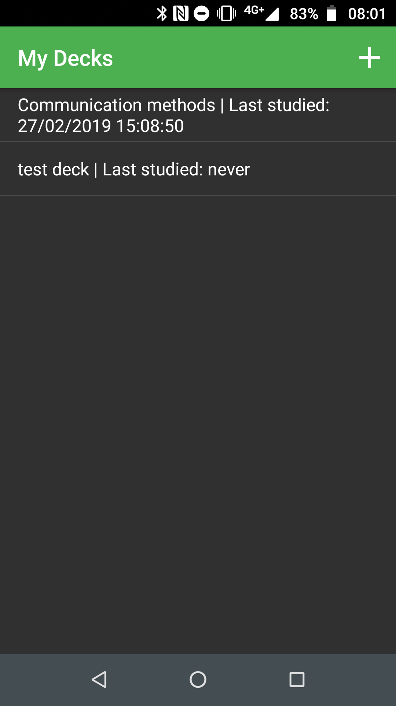
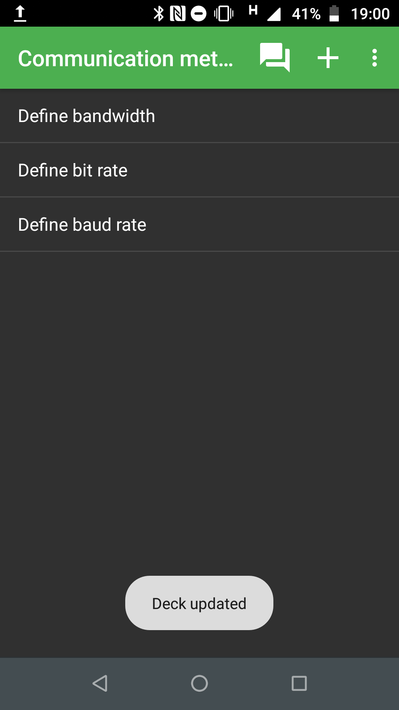
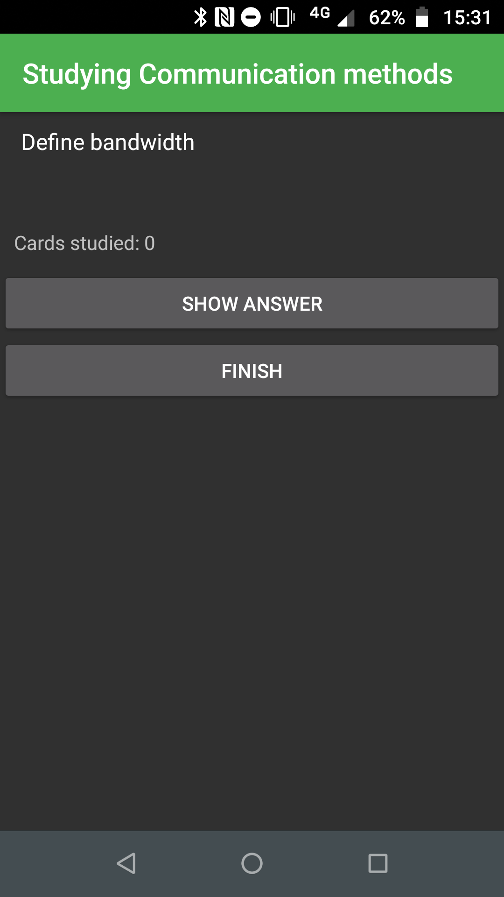
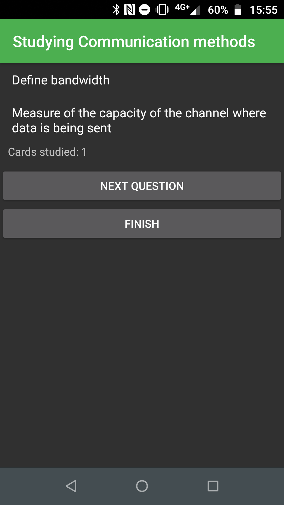
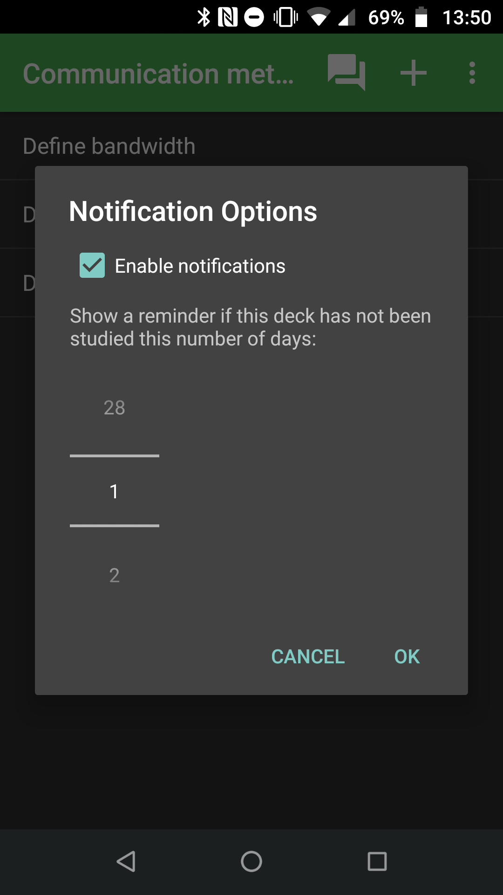
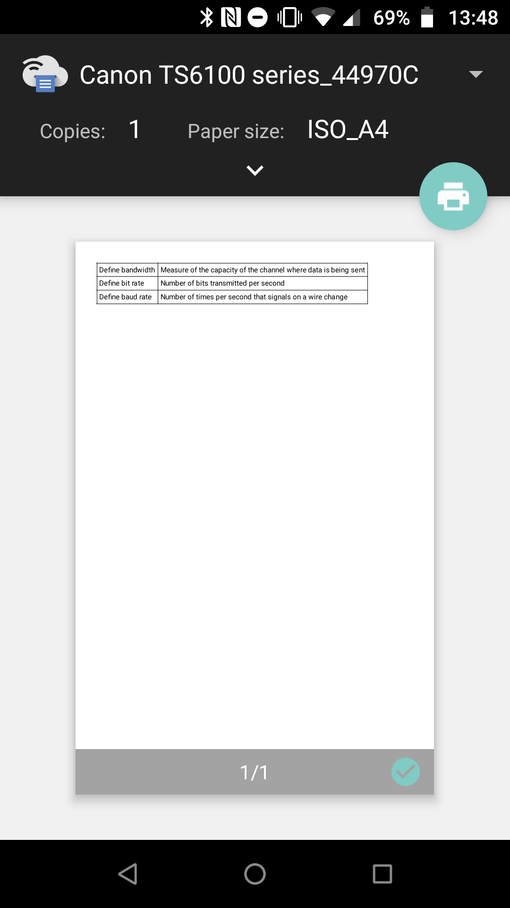

# Android Revision Card App
## Install on your Android device
1. Download the following APK file:

   [Download APK file](https://1drv.ms/u/s!AkwCdeKs07DpjeY9zMTryYN-V2Tomw?e=Ztuys5 "Download from OneDrive")

2. Open the file on your Android device.

3. Click install and follow the instructions.

   > You must ignore warning messages such as 'Blocked by Play Protect', otherwise you will not be able to install the app.

4. Open the app.

## Highlighted Features
Organise your revision cards into decks

Add cards with questions and answers

Study a random selection of cards from a deck

   
   

 

Customisable notifications to remind you to study a deck

   
   

 

Print the cards in a deck

